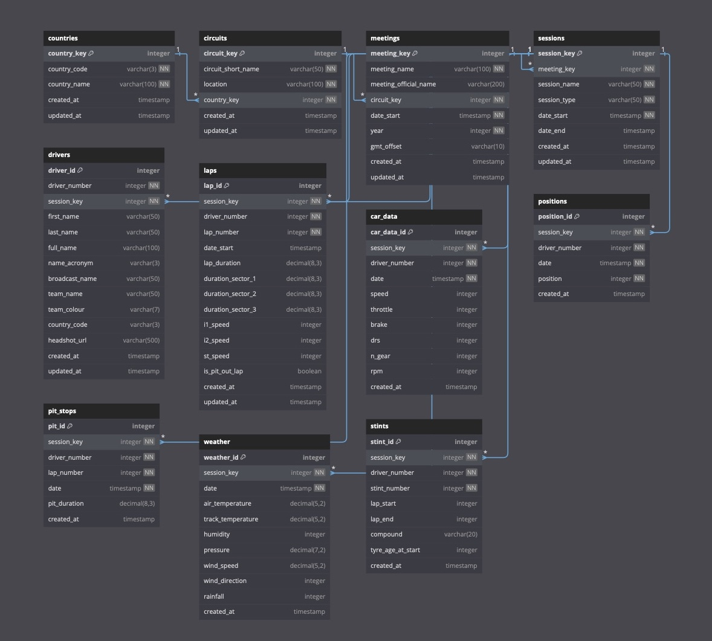

# Projeto de Extensão Curricularizados 2025.1

Este repositório contém arquivos desenvolvidos para o **Projeto de Extensão Curricularizado 2025.1**, com foco na análise de dados da Fórmula 1 utilizando SQL e Excel. O projeto faz parte das disciplinas de **Administração de Banco de Dados** e **Estatística** tem como objetivo integrar práticas reais de análise estatística a partir de dados de corridas da Fórmula 1.

## 👩‍💻 Alunos

- **Lucas Augusto Lourenço**  
  RA: 1210922211002  
  E-mail: lucasnucleofarma@gmail.com

- **Reginaldo Morikawa**  
  RA: 1210922311022  
  E-mail: morikawa77@gmail.com

- **Tháira Letícia Ibraim Lulio**  
  RA: 1210922211011  
  E-mail: thairalulio@gmail.com

---

## 📊 Diagrama do Banco de Dados

---

## 📂 Arquivos

### `f1stats.sql`

Este arquivo contém a estrutura completa de um banco de dados relacional voltado à Fórmula 1, com:

- Tabelas como: `Drivers`, `Laps`, `CarData`, `Sessions`, `Weather`, entre outras.
- Procedures, funções, views e triggers.
- Dados de exemplo para simulação de análises reais.

O banco foi modelado com foco em performance, integridade referencial e usabilidade analítica.

---

### `analise_f1_dados_com_graficos.xlsx`

Planilha que simula a análise estatística dos dados do banco de dados. Contém:

- **Aba "Estatísticas Voltas"**:  
  Inclui dados de tempo de volta de 4 pilotos e cálculos automáticos de:
  - Média
  - Mediana
  - Moda
  - Desvio padrão
  - Variância
  - Amplitude
  - Coeficiente de variação

- **Aba "Compostos Pneus"**:  
  Frequência de uso dos compostos de pneus (SOFT, MEDIUM, HARD), com:
  - Gráfico de Pizza
  - Gráfico de Barras

- **Aba "Regressão Linear"**:  
  Simulação da tendência dos tempos médios por volta com:
  - Gráfico de Linha

- **Aba "Dispersão Tempo-Vel"**:  
  Relação entre a velocidade média e tempo de volta, com:
  - Gráfico de Dispersão

---

## 📈 Objetivos Didáticos

- Aplicar conceitos de modelagem e análise de banco de dados.
- Utilizar funções estatísticas como média, desvio padrão e regressão linear.
- Representar graficamente os dados de forma significativa para tomada de decisão.
- Integrar ferramentas SQL e Excel na prática analítica.

---

## 🏁 Conclusão

Este projeto reforça a importância da integração entre dados reais, ferramentas de análise e visualização de dados, além de aplicar fundamentos estatísticos para interpretações críticas em ambientes de tecnologia da informação.

